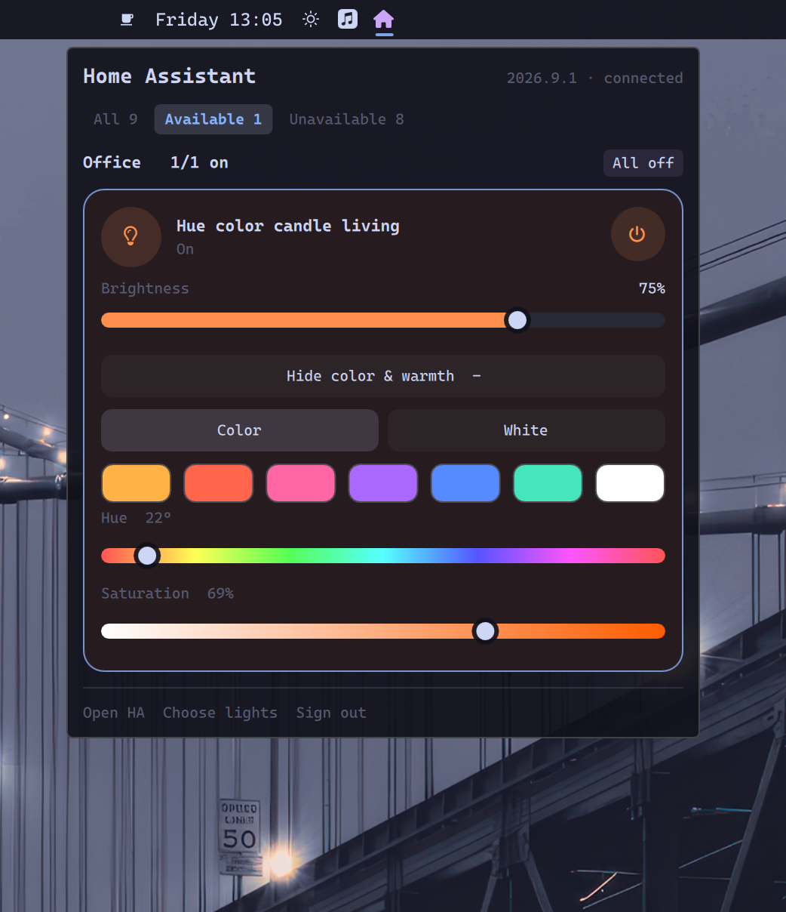

# Omarchy Home Assistant bar

Control Home Assistant lights by area directly from the Omarchy 4.0 bar. The native Quickshell widget uses a shared Python controller for secure authentication and live state; it is not a Waybar module or standalone QML app.



**Pre-release:** manifest version `0.1.0` is not yet a validated plugin release. Licensed under [MIT](LICENSE). Live host acceptance is required before tagging a release. See [SECURITY.md](SECURITY.md).

## Requirements and compatibility

- Omarchy 4.0 with its Quickshell plugin host (`qs.Ui`, `qs.Commons`, service and bar-widget entry points, and `bar.shell.serviceFor`).
- Linux user session with systemd user services, `XDG_RUNTIME_DIR`, D-Bus and an unlocked Secret Service keyring (GNOME Keyring). The controller pins the Secret Service backend, not KWallet.
- `/usr/bin/python3` with venv support, system `aiohttp` and `keyring`; browser plus `xdg-open`. Recorded bring-up: Python 3.14.7, aiohttp 3.13.5, keyring 25.7.0. aiohttp must provide `ClientWSTimeout`; final WebSocket origin validation currently uses its internal response URL, tested with 3.13.5.
- `uv` or Python 3.13 to provision hash-pinned `homeassistant-cli==1.0.0`. Its async commands do not work with Python 3.14. Controller and CLI have separate environments.
- Home Assistant with browser authorization and WebSocket APIs; recorded bring-up used HA 2026.9.1. No minimum HA version has been established.

## Install

Install and enable the plugin through Omarchy:

```bash
omarchy plugin add https://github.com/iuliansafta/omarchy-home-assistant-bar.git --enable
```

The widget uses a separate controller because credentials never live in QML. Install and start it from the plugin clone:

```bash
bash ~/.config/omarchy/plugins/iulian.home-assistant/controller/install.sh
```

The second command provisions environments, writes a systemd user unit and launcher symlink, and **enables/starts** `omarchy-home-assistant.service`. It may download the hash-pinned `hass-cli` environment. Omarchy intentionally does not run plugin install hooks, so this explicit controller step is required.

Open the widget, enter the HA base URL, and sign in through the browser. Prefer **HTTPS**: HTTP is supported but sends credentials in plaintext over the network. Unlock the keyring if prompted, then choose areas/lights.

Paths default to `~/.config/omarchy-home-assistant/config.json`, `~/.local/share/omarchy-home-assistant/hass-cli-venv`, and `~/.local/bin/omarchy-ha`. Installer paths honor `XDG_CONFIG_HOME`, `XDG_DATA_HOME`, and `XDG_BIN_HOME` respectively. The controller must receive the same XDG environment in its systemd user service; shell exports alone do not ensure that. `OMARCHY_HA_HASS_CLI` on the controller overrides CLI discovery. IPC uses `$XDG_RUNTIME_DIR/omarchy-ha/controller.sock`; `OMARCHY_HA_SOCKET` overrides only the QML client.

## Usage and behavior

The controller streams HA state; widgets do not poll the CLI. Area actions send explicit selected, visible, available light IDs, not HA whole-area targets. Offline actions are rejected, never replayed. Service acceptance is not observed light state.

Read-only CLI examples: `omarchy-ha info`, `omarchy-ha area list`, `omarchy-ha state get light.example`. Only validated commands/options are forwarded. CLI output has a combined 512 KiB collection ceiling and a 60-second timeout; overflow/timeout terminates the child and returns an error. Credential/debug options are rejected.

Widgets exist per monitor with a single shared service/IPC target. Panel requests currently reach all connected widget instances; focused-monitor routing is not guaranteed. Multi-monitor behavior needs live verification.

## Upgrade and uninstall

Update the plugin checkout with:

```bash
omarchy plugin update iulian.home-assistant
```

Then rerun `controller/install.sh` from the installed plugin path and restart `omarchy-home-assistant.service`. The installer **skips CLI provisioning if the executable exists** and `enable --now` does not explicitly restart an already-running controller. To apply a changed CLI lock, stop the service, remove/recreate only its dedicated `hass-cli-venv` under your resolved data directory, and rerun the installer. QML/JS changes should reload through Omarchy; if they remain cached, run `omarchy-restart-shell`. These commands affect the live desktop.

To uninstall deliberately:

1. While the controller/keyring are available, use widget **Sign out**. If server revocation fails, revoke the session in your Home Assistant profile too. Verify deletion of the Secret Service entry (service `omarchy-home-assistant`, account `ha-refresh-token`) with your keyring manager; deleting config does not delete keyring credentials.
2. Run `systemctl --user disable --now omarchy-home-assistant.service`; remove its unit from your resolved XDG config directory's `systemd/user/`, then run `systemctl --user daemon-reload`.
3. Remove the launcher symlink from your resolved XDG bin directory, the installed plugin's `controller/.venv`, and optionally the dedicated CLI venv and non-secret config directory. Inspect resolved paths before deletion. Do not delete unrelated user data.
4. Remove the plugin with `omarchy plugin remove iulian.home-assistant`.

## Troubleshooting and offline checks

Use `systemctl --user status omarchy-home-assistant.service` and `journalctl --user -u omarchy-home-assistant -f`. Do not post raw logs/config/history without reviewing private URLs, identities and credentials. Never start a second controller against the live runtime directory: startup unlinks the socket. `controller/ipc_client.py` is a developer tool that connects to the running controller, not an offline test runner.

From the checkout, with pytest, aiohttp, keyring and Node available:

```sh
PYTHONDONTWRITEBYTECODE=1 PYTEST_DISABLE_PLUGIN_AUTOLOAD=1 \
python -m pytest -p no:cacheprovider -q -rs controller/tests
bash -n controller/install.sh controller/render_systemd_unit.sh
```

If PATH Python lacks system packages, use the dependency-aware `PYTHONPATH` command in [AGENTS.md](AGENTS.md). Confirm zero skips (aiohttp and Node modules can otherwise skip). Tests use mocks, temporary sockets, loopback servers and disposable subprocesses, not live HA/keyring/device actions. CI does not validate QML, installation or hardware.

Before any version/tag/release: complete independent security review, owner attribution and reachable-history privacy decisions, record exact host versions, and obtain explicit permission for fresh-install, QML/multi-monitor, reconnect and real light-control acceptance. Then agree release notes and version/tag; no automatic publishing workflow is provided.
